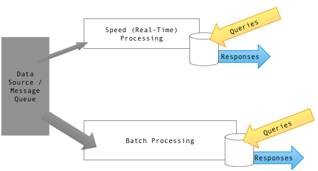

# Lambda Architecture

Lambda Architecture is a big-data processing design pattern that combines batch and streaming processing to provide both accurate historical insights and low-latency real-time updates.

## 1. Batch Layer
The batch layer precomputes results using a distributed processing system that can handle very large quantities of data. The batch layer aims at perfect accuracy by being able to process all available data when generating views. This means it can fix any errors by recomputing based on the complete data set, then updating existing views. Output is typically soteed in a read-only database, with updates completely replacing existing precomputed views.

## 2. Speed Layer
The speed layer processes data streams in real time and without the requirements of fix-ups or completeness. This layer sacrifices throughput as it aims to minimize latency by providing real-time views into the most recent data.
This layer's views may not be as accurate or complete as the ones eventually produced by the batch layer, but they are available almost immediately after data is received.

## 3. Serving Layer
Output from the batch and speed layers are stored in the serving layer, which responds to ad-hoc queries by returning precomputed views or building views from the processed data.

## Pros and Cons
**Pros**
- **No Server Management** – you do not have to install, maintain, or administer any software.
- High fault-tolerant
- provide historical corectness
- delivers quick real-time updates.

**Cons**
- **Complexity** – lambda architectures can be highly complex. Overhead to maintain two separate code bases for batch and streaming layers, which can make debugging difficult.

